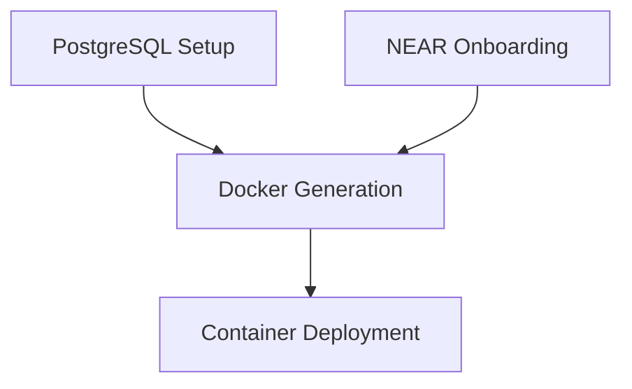

# ETRAP Docker Container Setup

This directory contains the Docker container generation system for ETRAP (Enterprise Transaction Recording and Audit Platform) customer organizations.

## Overview

ETRAP provides tamper-proof digital receipts for enterprise database transactions using a hybrid blockchain integrity platform. Each customer organization gets their own containerized deployment that includes:

- **Debezium Server** - Captures PostgreSQL database changes via CDC
- **Redis Server** - Streams CDC events for processing
- **ETRAP CDC Agent** - Processes events and creates blockchain proofs on NEAR Protocol

## Prerequisites

Before generating a Docker container for a customer organization, ensure you have:

1. **Docker Compose v2**
   - Docker Compose v2 is required (uses `docker compose` command)
   - Verify with: `docker compose version`
   - If you have v1 (`docker-compose`), please upgrade to v2

2. **PostgreSQL Configuration**
   - Database configured for CDC with logical replication
   - Debezium user created with proper permissions
   - See [PostgreSQL Setup](#postgresql-setup) section below

3. **NEAR Account Setup**
   - Organization's NEAR account created
   - ETRAP smart contract deployed and initialized
   - See [NEAR Onboarding Guide](../onboarding.md)

4. **AWS S3 Access**
   - S3 credentials with permissions to create buckets and store objects
   - Required for storing Merkle trees and batch metadata

> 📝 **Note**: PostgreSQL setup and NEAR onboarding can be done in parallel by different teams. Both must be complete before generating Docker containers.

### PostgreSQL Setup

PostgreSQL must be configured for Change Data Capture (CDC) before deploying ETRAP containers. This involves configuring logical replication, creating a dedicated user, replication slot, and publication.

#### Quick Setup Script

Use the provided setup script for automated configuration:

```bash
# Generate and execute PostgreSQL setup
./docker/setup-postgresql.sh \
  --database etrapdb \
  --debezium-user debezium \
  --debezium-password your_secure_password \
  --postgres-host db_ip_address \
  --postgres-port dp_port \
  --execute
  
# Or generate SQL script only (for review/manual execution)
./docker/setup-postgresql.sh \
  --database etrapdb \
  --debezium-user debezium \
  --debezium-password your_secure_password
```

#### Executing Generated SQL Script Manually

If the `--execute` option fails due to permission issues (e.g., no postgres password), you can manually execute the generated SQL:

1. **Copy the generated SQL file to your PostgreSQL server:**
   ```bash
   scp setup-postgresql.sql ubuntu@your-postgres-server:~/
   ```

2. **SSH into your PostgreSQL server and execute the script:**
   ```bash
   # Copy to a location accessible by postgres user
   sudo cp ~/setup-postgresql.sql /tmp/
   sudo chmod 644 /tmp/setup-postgresql.sql
   
   # Execute as postgres superuser
   sudo -u postgres psql -d your_database -f /tmp/setup-postgresql.sql
   ```

3. **Expected output:**
   - User `debezium` created with replication privileges
   - Replication slot `etrap_debezium_slot` created
   - Publication `etrap_publication` created for all tables
   - Permissions granted and REPLICA IDENTITY configured

The script will show verification steps and confirm successful setup completion.

#### Manual Setup Steps

If you prefer manual configuration, follow these steps:

##### 1. Configure PostgreSQL Server

Add these settings to `postgresql.conf`:

```ini
# Replication settings for Change Data Capture
wal_level = logical
max_replication_slots = 4
max_wal_senders = 4

# Optional: Improve replication performance
wal_sender_timeout = 60s
wal_receiver_timeout = 60s
```

Add these entries to `pg_hba.conf`:

```
# Allow debezium user to connect to database
host    etrapdb       debezium    0.0.0.0/0    md5

# Allow debezium user replication connections  
host    replication   debezium    0.0.0.0/0    md5
```

Restart PostgreSQL server after configuration changes.

##### 2. Create Database and User

```sql
-- Create the database (if it doesn't exist)
CREATE DATABASE etrapdb;

-- Connect to the database
\c etrapdb

-- Create debezium user with replication privileges
CREATE USER debezium WITH REPLICATION PASSWORD 'your_secure_password';

-- Grant necessary permissions
GRANT CONNECT ON DATABASE etrapdb TO debezium;
GRANT USAGE ON SCHEMA public TO debezium;
GRANT SELECT ON ALL TABLES IN SCHEMA public TO debezium;
GRANT SELECT ON ALL SEQUENCES IN SCHEMA public TO debezium;
ALTER DEFAULT PRIVILEGES IN SCHEMA public GRANT SELECT ON TABLES TO debezium;
```

##### 3. Create Replication Slot and Publication

```sql
-- Create replication slot for ETRAP
SELECT pg_create_logical_replication_slot('etrap_debezium_slot', 'pgoutput');

-- Create publication for all tables
CREATE PUBLICATION etrap_publication FOR ALL TABLES;
```

##### 4. Verify Setup

```sql
-- Check replication slot
SELECT slot_name, plugin, slot_type, database, active 
FROM pg_replication_slots 
WHERE slot_name = 'etrap_debezium_slot';

-- Check publication
SELECT pubname, puballtables 
FROM pg_publication 
WHERE pubname = 'etrap_publication';

-- Test debezium user connection
\c etrapdb debezium
SELECT current_user, current_database();
```

#### Troubleshooting PostgreSQL Setup

**Common Issues:**

1. **WAL Level Errors**: Ensure `wal_level = logical` in postgresql.conf and restart server
2. **Permission Denied**: Check pg_hba.conf entries and reload config with `SELECT pg_reload_conf()`
3. **Replication Slot Conflicts**: Drop existing slot with `SELECT pg_drop_replication_slot('slot_name')`
4. **Connection Issues**: Verify firewall settings and PostgreSQL listen_addresses

**Verification Commands:**

```bash
# Test connection as debezium user
psql -h your_host -p 5432 -U debezium -d etrapdb -c "SELECT 1;"

# Check replication permissions
psql -h your_host -p 5432 -U debezium -d etrapdb -c "SELECT pg_is_in_recovery();"
```

## Complete Setup Workflow

The ETRAP platform setup workflow:



### Prerequisites (Can be done in parallel)

#### PostgreSQL Setup

From the main ETRAP directory, run:

```bash
./docker/setup-postgresql.sh \
  --database etrapdb \
  --debezium-user debezium \
  --debezium-password secure_password \
  --execute
```

This creates:
- Debezium user with replication privileges
- Replication slot `etrap_debezium_slot`
- Publication `etrap_publication`
- Proper permissions and configurations

#### NEAR Account Setup

From the main ETRAP directory, run:

```bash
./onboard_organization.sh \
  --organization-name "Vantage Corp" \
  --organization-id "vantage" \
  --near-network testnet
```

This creates:
- NEAR account (e.g., `vantage.testnet`)
- Deploys ETRAP smart contract
- Initializes contract with organization details

### Docker Container Generation

After both PostgreSQL and NEAR are configured, generate the Docker containers.

From the main ETRAP directory, run:

```bash
./generate_etrap_docker.sh \
  --organization-name "Vantage Corp" \
  --organization-id "vantage" \
  --postgres-host "10.0.0.12" \
  --postgres-database "etrapdb" \
  --postgres-username "debezium" \
  --postgres-password "password123" \
  --near-network "testnet" \
  --aws-access-key-id "AKIA..." \
  --aws-secret-access-key "xyz..."
```

This generates a complete Docker deployment in `docker/etrap-vantage/`

### Container Deployment

Deploy the generated containers:

```bash
cd docker/etrap-vantage
docker compose up -d
```

Monitor the deployment:

```bash
# Check container status
docker compose ps

# View logs
docker compose logs -f

# Run health checks
docker compose exec etrap-agent /app/scripts/health-check.sh all
```

## Generated Structure

For each organization, the generator creates:

```
docker/etrap-{organization_id}/
├── Dockerfile                              # Multi-stage container build
├── docker-compose.yml                      # Service orchestration
├── config/
│   ├── debezium-application.properties     # Debezium PostgreSQL → Redis config
│   ├── redis.conf                          # Redis server configuration
│   └── near-credentials.json               # NEAR account credentials
├── scripts/
│   ├── entrypoint.sh                       # Container startup script
│   └── health-check.sh                     # Service health monitoring
├── requirements.txt                        # Python dependencies (copied)
├── etrap_cdc_agent.py                      # Main ETRAP agent (copied)
├── etrap_verify.py                         # Verification tools (copied)
├── .env                                    # Environment variables
└── DEPLOY.md                              # Deployment instructions
```

## Configuration Parameters

### Required Parameters

| Parameter | Description | Example |
|-----------|-------------|---------|
| `--organization-name` | Human readable name | "Vantage Corp" |
| `--organization-id` | Unique identifier | "vantage" |
| `--postgres-host` | PostgreSQL server | "10.0.0.12" |
| `--postgres-database` | Database to monitor | "etrapdb" |
| `--postgres-username` | DB username | "debezium" |
| `--postgres-password` | DB password | "password123" |
| `--near-network` | testnet/mainnet | "testnet" |
| `--aws-access-key-id` | AWS credentials | "AKIA..." |
| `--aws-secret-access-key` | AWS credentials | "xyz..." |

### Optional Parameters

| Parameter | Description | Default |
|-----------|-------------|---------|
| `--postgres-port` | PostgreSQL port | 5432 |
| `--aws-region` | AWS region | us-west-2 |
| `--near-private-key` | NEAR private key | (read from credential file) |
| `--force` | Overwrite existing | false |

## Architecture

### Container Components

1. **Base Image**: OpenJDK 11 JRE (for Debezium compatibility)
2. **Python Runtime**: Python 3.9+ installed on Java base
3. **Debezium Server**: Downloaded and configured for PostgreSQL → Redis
4. **Redis Server**: Separate service for message streaming
5. **ETRAP Agent**: Python application for blockchain integration

### Data Flow

```
PostgreSQL DB → Debezium → Redis Streams → ETRAP Agent → NEAR Blockchain + S3
```

### Network Architecture

- **Internal Network**: Services communicate via Docker network
- **External Connections**: 
  - PostgreSQL (external server)
  - NEAR Protocol (testnet/mainnet)
  - AWS S3 (specified region)

## Management

### Starting/Stopping Services

```bash
# Start all services
docker compose up -d

# Stop all services  
docker compose down

# Restart specific service
docker compose restart etrap-agent

# View service logs
docker compose logs -f redis
docker compose logs -f debezium
docker compose logs -f etrap-agent
```

### Health Monitoring

```bash
# Check all services
docker compose exec etrap-agent /app/scripts/health-check.sh all

# Check individual services
docker compose exec etrap-agent /app/scripts/health-check.sh redis
docker compose exec etrap-agent /app/scripts/health-check.sh debezium
docker compose exec etrap-agent /app/scripts/health-check.sh agent
```

### Troubleshooting

#### Common Issues

1. **Debezium Connection Errors**
   ```bash
   # Check PostgreSQL connectivity
   docker compose exec debezium /app/scripts/health-check.sh debezium
   
   # Verify replication slot
   docker compose logs debezium | grep "slot\|publication"
   ```

2. **NEAR Credential Issues**
   ```bash
   # Verify credential file
   docker compose exec etrap-agent cat /root/.near-credentials/testnet/vantage.testnet.json
   
   # Check NEAR connectivity
   docker compose exec etrap-agent near view vantage.testnet get_organization_info
   ```

3. **Redis Stream Issues**
   ```bash
   # Monitor Redis streams
   docker compose exec redis redis-cli XINFO GROUPS etrap.public.*
   
   # Check stream contents
   docker compose exec redis redis-cli XREAD STREAMS etrap.public.financial_transactions 0-0
   ```

4. **S3 Access Issues**
   ```bash
   # Test S3 connectivity
   docker compose exec etrap-agent python -c "import boto3; print(boto3.client('s3').list_buckets())"
   ```

## Security Considerations

1. **Credentials Management**: All sensitive data stored in `.env` file
2. **Network Isolation**: Services communicate via internal Docker network
3. **File Permissions**: Credential files mounted read-only
4. **Resource Limits**: Memory and CPU limits configured in docker-compose

## Development

### Template System

The generator uses template files in `docker/*.template` that support variable substitution:

- `${ORGANIZATION_NAME}` - Human readable name
- `${ORGANIZATION_ID}` - Unique identifier  
- `${POSTGRES_HOST}` - Database server
- `${NEAR_NETWORK}` - Blockchain network
- `${AWS_REGION}` - S3 region

### Extending Templates

To modify the container setup:

1. Edit template files in `docker/*.template`
2. Update variable substitution in `generate_etrap_docker.sh`
3. Test with a new organization

### Custom Configurations

Each generated container is independent and can be customized:

1. Modify configuration files in `config/`
2. Update environment variables in `.env`
3. Restart services with `docker compose up -d`

## Integration with ETRAP Workflow

This Docker system integrates with the existing ETRAP deployment workflow:

1. **PostgreSQL Setup**: Configure database with `setup-postgresql.sh` for CDC
2. **Onboarding**: `onboard_organization.sh` creates NEAR account and deploys contract
3. **Container Generation**: `generate_etrap_docker.sh` creates Docker setup
4. **Deployment**: Customer deploys container in their environment
5. **Monitoring**: Use existing ETRAP verification tools (`etrap_verify.py`, etc.)

## PostgreSQL Setup Files

The Docker directory includes PostgreSQL configuration tools:

### Setup Scripts

- **`setup-postgresql.sh`** - Main setup script with parameter handling
- **`setup-postgresql.sql.template`** - SQL template for database configuration

### Generated Files

When you run `setup-postgresql.sh`, it generates:

- **`setup-postgresql.sql`** - Customized SQL script for your database
- **`postgresql.conf.example`** - PostgreSQL configuration settings
- **`pg_hba.conf.example`** - Authentication configuration

### Usage Examples

```bash
# Basic setup
./docker/setup-postgresql.sh \
  --database etrapdb \
  --debezium-user debezium \
  --debezium-password mypassword

# Execute immediately
./docker/setup-postgresql.sh \
  --database etrapdb \
  --debezium-user debezium \
  --debezium-password mypassword \
  --execute

# Custom configuration
./docker/setup-postgresql.sh \
  --database mydb \
  --debezium-user myuser \
  --debezium-password mypass \
  --replication-slot my_slot \
  --publication my_pub \
  --postgres-host 10.0.0.12
```

### Security Considerations

1. **Strong Passwords**: Use secure passwords for the debezium user
2. **Network Access**: Restrict pg_hba.conf to specific IP ranges in production
3. **SSL Connections**: Enable SSL for replication connections in production
4. **Monitoring**: Monitor replication lag and slot usage

## Support

For deployment issues:

1. Check the generated `DEPLOY.md` file for organization-specific instructions
2. Review health check logs: `docker compose exec etrap-agent /app/scripts/health-check.sh all`
3. Examine service logs: `docker compose logs -f [service_name]`
4. Verify external connectivity (PostgreSQL, NEAR, S3)